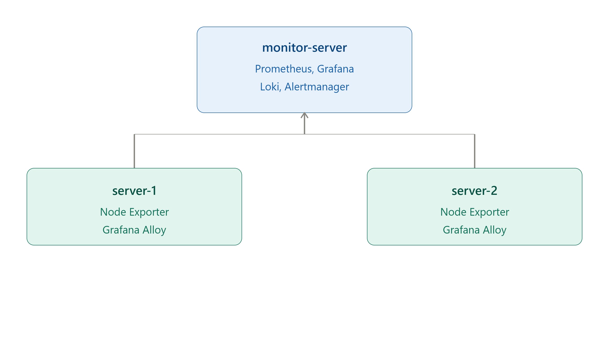

# 🚀 AWS Monitoring Stack using Prometheus, Grafana, Loki, Grafana Alloy & Alertmanager

A production-inspired monitoring and centralized logging solution built on **AWS EC2** using **Prometheus, Grafana, Loki, Grafana Alloy, Alertmanager, and Node Exporter**.

---

# 📖 Project Overview

This project demonstrates how to build a complete monitoring and centralized logging solution on AWS using open-source observability tools.

The monitoring stack collects infrastructure metrics from multiple Linux servers using **Node Exporter**, stores them in **Prometheus**, visualizes them in **Grafana**, collects logs using **Grafana Alloy**, stores logs in **Loki**, and sends email notifications using **Alertmanager** whenever predefined alert conditions are met.

The entire solution was deployed on **Amazon EC2** instances and follows production-inspired monitoring practices.

---

# 🛠️ Tech Stack

| Tool | Purpose |
|------|---------|
| AWS EC2 | Infrastructure |
| Ubuntu 24.04 LTS | Operating System |
| Prometheus | Metrics Collection |
| Node Exporter | Linux Metrics |
| Grafana | Visualization |
| Loki | Log Aggregation |
| Grafana Alloy | Log Collection |
| Alertmanager | Alert Routing |
| Gmail SMTP | Email Notifications |

---

# ✨ Features

- ✅ Infrastructure Monitoring
- ✅ CPU Monitoring
- ✅ Memory Monitoring
- ✅ Disk Monitoring
- ✅ Network Monitoring
- ✅ Centralized Logging
- ✅ Multi-Server Monitoring
- ✅ Email Alerts
- ✅ Grafana Dashboards
- ✅ Loki Log Exploration
- ✅ Production-Style Deployment

---

# 🏗️ Architecture

The monitoring stack follows a centralized architecture where one EC2 instance acts as the monitoring server while two EC2 instances are monitored.

### Monitor Server
- Prometheus
- Grafana
- Loki
- Alertmanager

### Server-1
- Node Exporter
- Grafana Alloy

### Server-2
- Node Exporter
- Grafana Alloy

The architecture diagram below illustrates the complete monitoring, logging, and alerting workflow.



---

# 🔄 Project Workflow

This monitoring stack consists of three major workflows: **Metrics Collection**, **Log Collection**, and **Alerting**.

## 📊 Metrics Collection Workflow

Infrastructure metrics such as CPU, Memory, Disk, Network, and Filesystem usage are collected from each Linux server using **Node Exporter**. Prometheus periodically scrapes these metrics and stores them in its time-series database. Grafana then queries Prometheus to visualize the collected metrics through interactive dashboards.

```text
Server-1              Server-2
   │                      │
   ▼                      ▼
Node Exporter        Node Exporter
        │             │
        └──────┬──────┘
               ▼
          Prometheus
               │
               ▼
            Grafana
```

---

## 📜 Log Collection Workflow

System logs generated on each Linux server are collected by **Grafana Alloy**. Alloy continuously watches log files under `/var/log`, forwards them to Loki, and Grafana Explore is used to search and visualize the centralized logs.

```text
Linux Log Files
        │
        ▼
 Grafana Alloy
        │
        ▼
      Loki
        │
        ▼
 Grafana Explore
```

---

## 🚨 Alerting Workflow

Prometheus continuously evaluates alert rules. When a rule condition is satisfied (for example, high CPU usage), the alert is forwarded to Alertmanager, which sends an email notification to the configured recipient.

```text
Node Exporter
      │
      ▼
 Prometheus
      │
 Alert Rules
      │
      ▼
Alertmanager
      │
      ▼
Email Notification
```

---

# ☁️ AWS Infrastructure

The monitoring stack was deployed on three Amazon EC2 instances within the same Virtual Private Cloud (VPC). One instance acts as the centralized monitoring server, while the remaining two instances are monitored using Node Exporter and Grafana Alloy.

| Server | Components Installed | Purpose |
|---------|----------------------|---------|
| **Monitor Server** | Prometheus, Grafana, Loki, Alertmanager | Collects metrics, stores logs, visualizes dashboards, and sends alert notifications |
| **Server-1** | Node Exporter, Grafana Alloy | Exposes system metrics and forwards system logs |
| **Server-2** | Node Exporter, Grafana Alloy | Exposes system metrics and forwards system logs |

### Communication Between Components

| Source | Destination | Purpose |
|----------|-------------|---------|
| Node Exporter | Prometheus | Infrastructure Metrics |
| Grafana Alloy | Loki | System Logs |
| Grafana | Prometheus | Metrics Visualization |
| Grafana | Loki | Log Exploration |
| Prometheus | Alertmanager | Alert Routing |
| Alertmanager | Gmail SMTP | Email Notifications |

---

## Network Ports Used

| Port | Service |
|------|----------|
| **3000** | Grafana |
| **3100** | Loki |
| **9090** | Prometheus |
| **9093** | Alertmanager |
| **9100** | Node Exporter |

---

# 📸 Project Screenshots

Project screenshots are available in the **screenshots/** directory.

The screenshots demonstrate:

- Architecture Diagram
- Prometheus Targets
- Grafana Node Exporter Dashboard
- Grafana Explore (Server-1 Logs)
- Grafana Explore (Server-2 Logs)
- Alertmanager UI
- Prometheus Alerts
- Email Notification

---                                                                                                                                                                                                                                                                                                                               

  # 📂 Repository Structure

```
aws-monitoring-stack-prometheus-grafana/
│
├── README.md
├── architecture/
│   └── architecture.png
├── configs/
│   ├── prometheus/
│   ├── grafana/
│   ├── loki/
│   ├── alloy/
│   └── alertmanager/
├── docs/
│   └── Monitoring-Stack-Documentation.pdf
├── screenshots/
│   ├── architecture.png
│   ├── prometheus-targets.png
│   ├── grafana-dashboard.png
│   ├── server1-logs.png
│   ├── server2-logs.png
│   ├── alertmanager-ui.png
│   ├── prometheus-alerts.png
│   └── email-notification.png
└── assets/
```
  
  # 👨‍💻 Author

**Amit Sharma**

DevOps Engineer | AWS Certified Solutions Architect – Associate

### Connect with Me

- LinkedIn: https://linkedin.com/in/amitsharma2003/
- GitHub: https://github.com/amitsharma-2003/
  
  
  
  
  
  
  
  
  
  
  
  
  
